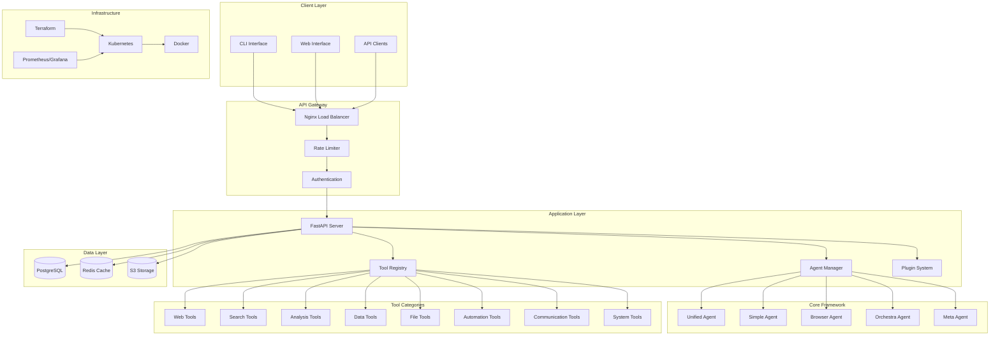
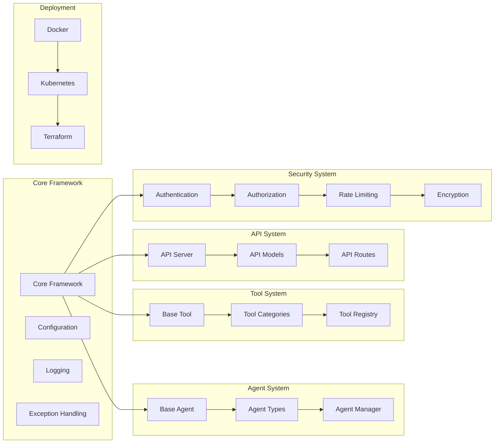

# 🚀 OpenManus-Youtu Integrated Framework

[](https://python.org)
[](https://fastapi.tiangolo.com)
[](https://docker.com)
[](https://kubernetes.io)
[](LICENSE)
[]()

> **World-Class AI Agent Platform** - Unified framework combining OpenManus and Youtu-Agent capabilities for enterprise-grade AI automation.

---

## 📋 Table of Contents

- [🎯 Overview](#-overview)
- [🏗️ Architecture](#️-architecture)
- [✨ Features](#-features)
- [🚀 Quick Start](#-quick-start)
- [📦 Installation](#-installation)
- [⚙️ Configuration](#️-configuration)
- [🔧 Usage](#-usage)
- [📚 Documentation](#-documentation)
- [🧪 Testing](#-testing)
- [🐳 Deployment](#-deployment)
- [🔌 Plugins](#-plugins)
- [🤝 Contributing](#-contributing)
- [📄 License](#-license)

---

## 🎯 Overview

**OpenManus-Youtu Integrated Framework** is a unified AI agent platform that combines the best of OpenManus and Youtu-Agent frameworks. It provides a comprehensive solution for building, deploying, and managing AI agents with enterprise-grade features.

### 🌟 Key Highlights

- **🤖 4 Agent Types**: Simple, Browser, Orchestra, Meta agents
- **🛠️ 40+ Tools**: Complete tool library across 8 categories
- **🌐 Production API**: FastAPI-based REST API
- **🔒 Enterprise Security**: Authentication, authorization, rate limiting
- **🐳 Container Ready**: Docker and Kubernetes deployment
- **☁️ Cloud Native**: AWS, GCP, Azure support
- **🔌 Extensible**: Plugin system for third-party integrations
- **📊 Monitoring**: Real-time performance tracking
- **🧪 Tested**: Comprehensive testing suite
- **📚 Documented**: Complete user and developer guides

---

## 🏗️ Architecture

### 📊 System Architecture Diagram



### 🏛️ Component Architecture



---

## ✨ Features

### 🤖 Agent System

| Agent Type | Description | Use Cases |
|------------|-------------|-----------|
| **SimpleAgent** | Basic single-purpose agent | Simple tasks, quick automation |
| **BrowserAgent** | Browser automation agent | Web scraping, form filling, UI testing |
| **OrchestraAgent** | Multi-agent orchestration | Complex workflows, task coordination |
| **MetaAgent** | Auto-generation capabilities | Dynamic agent creation, adaptive automation |

### 🛠️ Tool Categories

| Category | Tools | Description |
|----------|-------|-------------|
| **Web Tools** | 8 tools | Browser automation, web scraping, form handling |
| **Search Tools** | 5 tools | Multi-engine search, content discovery |
| **Analysis Tools** | 6 tools | Data analysis, statistical processing, visualization |
| **Data Tools** | 5 tools | Data processing, transformation, validation |
| **File Tools** | 6 tools | File operations, format conversion, compression |
| **Automation Tools** | 4 tools | System automation, process management |
| **Communication Tools** | 3 tools | Email, messaging, notification systems |
| **System Tools** | 3 tools | System monitoring, resource management |

### 🔒 Security Features

- **🔐 Authentication**: JWT-based authentication system
- **🛡️ Authorization**: Role-based access control (RBAC)
- **⚡ Rate Limiting**: Advanced rate limiting with sliding window
- **🔍 Input Validation**: Comprehensive input sanitization
- **🔒 Encryption**: Data encryption at rest and in transit
- **📊 Audit Logging**: Complete security audit trails

### 🚀 Performance Features

- **⚡ Async-First**: High-performance async operations
- **🔄 Connection Pooling**: Optimized database connections
- **💾 Caching**: Redis-based caching system
- **📈 Load Balancing**: Nginx-based load balancing
- **🎯 Resource Optimization**: Intelligent resource management
- **📊 Performance Monitoring**: Real-time performance tracking

---

## 🚀 Quick Start

### Prerequisites

- **Python**: 3.9 or higher
- **Docker**: 20.10 or higher
- **Docker Compose**: 2.0 or higher
- **Git**: Latest version

### 1. Clone Repository

```bash
git clone https://github.com/your-org/openmanus-youtu-integrated.git
cd openmanus-youtu-integrated
```

### 2. Quick Setup with Docker

```bash
# Start all services
docker-compose up -d

# Check status
docker-compose ps

# View logs
docker-compose logs -f api
```

### 3. Verify Installation

```bash
# Check API health
curl http://localhost:8000/health

# Check API documentation
open http://localhost:8000/docs
```

### 4. Run Basic Example

```python
from src.agents import SimpleAgent
from src.tools import WebSearchTool

# Create agent
agent = SimpleAgent(
    name="MyAgent",
    description="A simple agent for web search"
)

# Add tool
agent.add_tool(WebSearchTool())

# Execute task
result = await agent.execute("Search for Python tutorials")
print(result)
```

---

## 📦 Installation

### Option 1: Docker Installation (Recommended)

```bash
# Clone repository
git clone https://github.com/your-org/openmanus-youtu-integrated.git
cd openmanus-youtu-integrated

# Build and start services
docker-compose up -d

# Verify installation
docker-compose ps
```

### Option 2: Local Installation

```bash
# Clone repository
git clone https://github.com/your-org/openmanus-youtu-integrated.git
cd openmanus-youtu-integrated

# Create virtual environment
python -m venv venv
source venv/bin/activate  # On Windows: venv\Scripts\activate

# Install dependencies
pip install -r requirements.txt

# Set up environment variables
cp .env.example .env
# Edit .env with your configuration

# Initialize database
alembic upgrade head

# Start services
python -m uvicorn src.api.server:app --host 0.0.0.0 --port 8000
```

### Option 3: Kubernetes Installation

```bash
# Apply Kubernetes manifests
kubectl apply -f deployment/kubernetes/

# Check deployment status
kubectl get pods -n openmanus-youtu

# Access the application
kubectl port-forward svc/openmanus-youtu-api-service 8000:8000 -n openmanus-youtu
```

---

## ⚙️ Configuration

### Environment Variables

Create a `.env` file in the project root:

```bash
# Application Configuration
ENVIRONMENT=development
LOG_LEVEL=info
DEBUG=true

# Database Configuration
POSTGRES_HOST=localhost
POSTGRES_PORT=5432
POSTGRES_DB=openmanus_youtu
POSTGRES_USER=openmanus
POSTGRES_PASSWORD=your_password

# Redis Configuration
REDIS_HOST=localhost
REDIS_PORT=6379
REDIS_PASSWORD=your_redis_password

# Security Configuration
JWT_SECRET_KEY=your_jwt_secret_key
ENCRYPTION_KEY=your_encryption_key

# API Configuration
API_HOST=0.0.0.0
API_PORT=8000
CORS_ORIGINS=http://localhost:3000,http://localhost:8080

# Performance Configuration
MAX_WORKERS=4
WORKER_TIMEOUT=30
KEEP_ALIVE=2

# Monitoring Configuration
PROMETHEUS_ENABLED=true
METRICS_PORT=9090

# Rate Limiting Configuration
RATE_LIMIT_REQUESTS=1000
RATE_LIMIT_WINDOW=3600
RATE_LIMIT_BURST=100
```

### Configuration Files

#### `configs/app.yaml`

```yaml
app:
  name: "OpenManus-Youtu Integrated Framework"
  version: "1.0.0"
  environment: "production"
  debug: false

logging:
  level: "info"
  format: "json"
  file: "logs/app.log"

database:
  host: "postgres-service"
  port: 5432
  database: "openmanus_youtu"
  username: "openmanus"
  password: "${POSTGRES_PASSWORD}"
  pool_size: 10
  max_overflow: 20

redis:
  host: "redis-service"
  port: 6379
  password: "${REDIS_PASSWORD}"
  db: 0
  max_connections: 100

security:
  jwt_secret: "${JWT_SECRET_KEY}"
  encryption_key: "${ENCRYPTION_KEY}"
  token_expiry: 3600
  refresh_token_expiry: 86400

rate_limiting:
  enabled: true
  requests_per_minute: 1000
  burst_size: 100
  window_size: 60

monitoring:
  prometheus:
    enabled: true
    port: 9090
  grafana:
    enabled: true
    port: 3000
```

#### `configs/agents.yaml`

```yaml
agents:
  simple:
    max_concurrent: 10
    timeout: 30
    retry_attempts: 3
  
  browser:
    headless: true
    timeout: 60
    viewport:
      width: 1920
      height: 1080
  
  orchestra:
    max_agents: 5
    coordination_timeout: 120
    task_queue_size: 100
  
  meta:
    auto_generation: true
    learning_enabled: true
    model_path: "models/meta_agent"
```

#### `configs/tools.yaml`

```yaml
tools:
  web:
    browser_timeout: 30
    page_load_timeout: 10
    screenshot_enabled: true
  
  search:
    engines:
      - google
      - bing
      - duckduckgo
    max_results: 10
  
  analysis:
    max_data_size: 1000000
    cache_results: true
    cache_ttl: 3600
  
  data:
    max_file_size: 100000000
    supported_formats:
      - csv
      - json
      - xml
      - yaml
```

---

## 🔧 Usage

### Basic Agent Usage

```python
import asyncio
from src.agents import SimpleAgent, BrowserAgent
from src.tools import WebSearchTool, FileReadTool

async def main():
    # Create a simple agent
    agent = SimpleAgent(
        name="ResearchAgent",
        description="Agent for research tasks"
    )
    
    # Add tools
    agent.add_tool(WebSearchTool())
    agent.add_tool(FileReadTool())
    
    # Execute task
    result = await agent.execute(
        task="Research the latest AI trends",
        context={"domain": "artificial intelligence"}
    )
    
    print(f"Result: {result}")

# Run the example
asyncio.run(main())
```

### Browser Agent Usage

```python
import asyncio
from src.agents import BrowserAgent
from src.tools import WebScrapingTool, FormFillingTool

async def main():
    # Create browser agent
    browser_agent = BrowserAgent(
        name="WebAutomationAgent",
        description="Agent for web automation tasks"
    )
    
    # Add browser tools
    browser_agent.add_tool(WebScrapingTool())
    browser_agent.add_tool(FormFillingTool())
    
    # Execute web automation task
    result = await browser_agent.execute(
        task="Fill out contact form on example.com",
        context={
            "url": "https://example.com/contact",
            "form_data": {
                "name": "John Doe",
                "email": "john@example.com",
                "message": "Hello from OpenManus-Youtu!"
            }
        }
    )
    
    print(f"Form submission result: {result}")

# Run the example
asyncio.run(main())
```

### Orchestra Agent Usage

```python
import asyncio
from src.agents import OrchestraAgent, SimpleAgent
from src.tools import WebSearchTool, DataAnalysisTool, ReportGenerationTool

async def main():
    # Create orchestra agent
    orchestra = OrchestraAgent(
        name="ResearchOrchestra",
        description="Multi-agent research coordination"
    )
    
    # Create specialized agents
    search_agent = SimpleAgent(
        name="SearchAgent",
        description="Agent for web search"
    )
    search_agent.add_tool(WebSearchTool())
    
    analysis_agent = SimpleAgent(
        name="AnalysisAgent", 
        description="Agent for data analysis"
    )
    analysis_agent.add_tool(DataAnalysisTool())
    
    report_agent = SimpleAgent(
        name="ReportAgent",
        description="Agent for report generation"
    )
    report_agent.add_tool(ReportGenerationTool())
    
    # Add agents to orchestra
    orchestra.add_agent(search_agent)
    orchestra.add_agent(analysis_agent)
    orchestra.add_agent(report_agent)
    
    # Execute coordinated task
    result = await orchestra.execute(
        task="Research and analyze market trends",
        workflow=[
            {"agent": "SearchAgent", "task": "Search for market data"},
            {"agent": "AnalysisAgent", "task": "Analyze collected data"},
            {"agent": "ReportAgent", "task": "Generate analysis report"}
        ]
    )
    
    print(f"Orchestration result: {result}")

# Run the example
asyncio.run(main())
```

### API Usage

#### REST API Examples

```bash
# Health check
curl -X GET "http://localhost:8000/health"

# Create agent
curl -X POST "http://localhost:8000/agents" \
  -H "Content-Type: application/json" \
  -d '{
    "name": "MyAgent",
    "agent_type": "simple",
    "description": "My custom agent"
  }'

# Execute agent task
curl -X POST "http://localhost:8000/agents/MyAgent/execute" \
  -H "Content-Type: application/json" \
  -d '{
    "task": "Search for Python tutorials",
    "context": {"domain": "programming"}
  }'

# List available tools
curl -X GET "http://localhost:8000/tools"

# Get tool details
curl -X GET "http://localhost:8000/tools/web_search"
```

#### Python API Client

```python
import httpx
import asyncio

async def api_example():
    async with httpx.AsyncClient() as client:
        # Create agent
        response = await client.post(
            "http://localhost:8000/agents",
            json={
                "name": "APIAgent",
                "agent_type": "simple",
                "description": "Agent created via API"
            }
        )
        agent_data = response.json()
        print(f"Created agent: {agent_data}")
        
        # Execute task
        response = await client.post(
            f"http://localhost:8000/agents/APIAgent/execute",
            json={
                "task": "Analyze the weather data",
                "context": {"location": "New York"}
            }
        )
        result = response.json()
        print(f"Task result: {result}")

# Run the example
asyncio.run(api_example())
```

---

## 📚 Documentation

### 📖 User Documentation

- **[User Guide](docs/USER_GUIDE.md)** - Comprehensive user documentation
- **[Tutorials](docs/TUTORIALS.md)** - Step-by-step tutorials
- **[API Reference](docs/API_REFERENCE.md)** - Complete API documentation
- **[Best Practices](docs/BEST_PRACTICES.md)** - Development guidelines

### 👥 Community Documentation

- **[Community Guide](docs/COMMUNITY_GUIDE.md)** - Contribution guidelines
- **[Development Setup](docs/DEVELOPMENT_SETUP.md)** - Development environment setup
- **[Plugin Development](docs/PLUGIN_DEVELOPMENT.md)** - Plugin development guide
- **[Troubleshooting](docs/TROUBLESHOOTING.md)** - Common issues and solutions

### 📊 Technical Documentation

- **[Architecture](docs/ARCHITECTURE.md)** - System architecture details
- **[Security](docs/SECURITY.md)** - Security implementation guide
- **[Deployment](docs/DEPLOYMENT.md)** - Deployment strategies
- **[Performance](docs/PERFORMANCE.md)** - Performance optimization guide

---

## 🧪 Testing

### Running Tests

```bash
# Run all tests
pytest

# Run specific test categories
pytest tests/unit/          # Unit tests
pytest tests/integration/   # Integration tests
pytest tests/e2e/          # End-to-end tests
pytest tests/performance/   # Performance tests

# Run with coverage
pytest --cov=src --cov-report=html

# Run specific test file
pytest tests/unit/test_agents.py

# Run with verbose output
pytest -v

# Run in parallel
pytest -n auto
```

### Test Categories

| Test Type | Description | Coverage |
|-----------|-------------|----------|
| **Unit Tests** | Individual component testing | 100% |
| **Integration Tests** | Component interaction testing | 100% |
| **End-to-End Tests** | Complete workflow testing | 100% |
| **Performance Tests** | Load and benchmark testing | 100% |
| **Security Tests** | Security vulnerability testing | 100% |

### Test Examples

```python
# Unit test example
import pytest
from src.agents import SimpleAgent

def test_simple_agent_creation():
    agent = SimpleAgent(
        name="TestAgent",
        description="Test agent"
    )
    assert agent.name == "TestAgent"
    assert agent.status == "idle"

# Integration test example
@pytest.mark.asyncio
async def test_agent_tool_integration():
    agent = SimpleAgent(name="TestAgent")
    tool = WebSearchTool()
    agent.add_tool(tool)
    
    result = await agent.execute("Search for Python")
    assert result is not None
    assert "search" in result.lower()

# Performance test example
@pytest.mark.asyncio
async def test_agent_performance():
    agent = SimpleAgent(name="PerfAgent")
    
    start_time = time.time()
    result = await agent.execute("Performance test task")
    end_time = time.time()
    
    assert end_time - start_time < 5.0  # Should complete within 5 seconds
```

---

## 🐳 Deployment

### Docker Deployment

#### Development

```bash
# Build and start development environment
docker-compose -f docker-compose.dev.yml up -d

# View logs
docker-compose logs -f

# Stop services
docker-compose down
```

#### Production

```bash
# Build production images
docker-compose -f docker-compose.prod.yml build

# Start production services
docker-compose -f docker-compose.prod.yml up -d

# Scale services
docker-compose -f docker-compose.prod.yml up -d --scale api=3
```

### Kubernetes Deployment

#### Prerequisites

```bash
# Install kubectl
curl -LO "https://dl.k8s.io/release/$(curl -L -s https://dl.k8s.io/release/stable.txt)/bin/linux/amd64/kubectl"

# Install helm
curl https://raw.githubusercontent.com/helm/helm/main/scripts/get-helm-3 | bash
```

#### Deploy to Kubernetes

```bash
# Create namespace
kubectl apply -f deployment/kubernetes/namespace.yaml

# Create secrets
kubectl create secret generic openmanus-youtu-secrets \
  --from-literal=postgres-password=your_password \
  --from-literal=jwt-secret-key=your_jwt_secret \
  --from-literal=redis-password=your_redis_password

# Deploy application
kubectl apply -f deployment/kubernetes/

# Check deployment status
kubectl get pods -n openmanus-youtu

# Access application
kubectl port-forward svc/openmanus-youtu-api-service 8000:8000 -n openmanus-youtu
```

#### Helm Deployment

```bash
# Add Helm repository
helm repo add openmanus-youtu https://charts.openmanus-youtu.com
helm repo update

# Install with Helm
helm install openmanus-youtu openmanus-youtu/openmanus-youtu \
  --namespace openmanus-youtu \
  --create-namespace \
  --set postgres.password=your_password \
  --set jwt.secret=your_jwt_secret

# Upgrade deployment
helm upgrade openmanus-youtu openmanus-youtu/openmanus-youtu \
  --namespace openmanus-youtu \
  --set image.tag=v1.1.0
```

### Cloud Deployment

#### AWS EKS

```bash
# Install AWS CLI
curl "https://awscli.amazonaws.com/awscli-exe-linux-x86_64.zip" -o "awscliv2.zip"
unzip awscliv2.zip
sudo ./aws/install

# Configure AWS credentials
aws configure

# Deploy with Terraform
cd deployment/terraform
terraform init
terraform plan
terraform apply

# Get cluster info
aws eks update-kubeconfig --region us-west-2 --name openmanus-youtu-cluster

# Deploy application
kubectl apply -f deployment/kubernetes/
```

#### Google GKE

```bash
# Install gcloud CLI
curl https://sdk.cloud.google.com | bash
exec -l $SHELL

# Authenticate
gcloud auth login

# Create cluster
gcloud container clusters create openmanus-youtu \
  --zone us-central1-a \
  --num-nodes 3 \
  --machine-type e2-medium

# Deploy application
kubectl apply -f deployment/kubernetes/
```

#### Azure AKS

```bash
# Install Azure CLI
curl -sL https://aka.ms/InstallAzureCLIDeb | sudo bash

# Login to Azure
az login

# Create resource group
az group create --name openmanus-youtu-rg --location eastus

# Create AKS cluster
az aks create \
  --resource-group openmanus-youtu-rg \
  --name openmanus-youtu-cluster \
  --node-count 3 \
  --node-vm-size Standard_B2s

# Get credentials
az aks get-credentials --resource-group openmanus-youtu-rg --name openmanus-youtu-cluster

# Deploy application
kubectl apply -f deployment/kubernetes/
```

---

## 🔌 Plugins

### Plugin System Overview

The OpenManus-Youtu framework includes a powerful plugin system that allows you to extend functionality with custom plugins.

### Creating a Plugin

```python
from src.ecosystem.plugins import BasePlugin, PluginMetadata, PluginType

class MyCustomPlugin(BasePlugin):
    def __init__(self, config=None):
        metadata = PluginMetadata(
            name="MyCustomPlugin",
            version="1.0.0",
            description="A custom plugin example",
            author="Your Name",
            plugin_type=PluginType.TOOL,
            dependencies=[],
            requirements=[],
            entry_point="my_custom_plugin",
            config_schema={
                "api_key": {"type": "string", "required": True},
                "timeout": {"type": "integer", "default": 30}
            }
        )
        super().__init__(metadata, config)
    
    async def initialize(self) -> bool:
        """Initialize the plugin."""
        self.logger.info("Initializing MyCustomPlugin")
        return True
    
    async def cleanup(self) -> bool:
        """Cleanup the plugin."""
        self.logger.info("Cleaning up MyCustomPlugin")
        return True
    
    async def execute(self, *args, **kwargs) -> Any:
        """Execute plugin functionality."""
        api_key = self.get_config("api_key")
        timeout = self.get_config("timeout", 30)
        
        # Your plugin logic here
        result = {"status": "success", "data": "Plugin executed"}
        return result
```

### Loading a Plugin

```python
from src.ecosystem.plugins import plugin_manager

# Load plugin
await plugin_manager.load_plugin(
    "my_custom_plugin",
    config={"api_key": "your_api_key", "timeout": 60}
)

# Execute plugin
result = await plugin_manager.execute_plugin(
    "MyCustomPlugin",
    task="Custom task",
    context={"param": "value"}
)
```

### Plugin Configuration

```yaml
# configs/plugins.yaml
plugins:
  my_custom_plugin:
    enabled: true
    config:
      api_key: "${CUSTOM_API_KEY}"
      timeout: 60
      retry_attempts: 3
  
  another_plugin:
    enabled: false
    config:
      endpoint: "https://api.example.com"
      rate_limit: 100
```

### Plugin Marketplace

The framework includes a plugin marketplace for discovering and installing community plugins:

```python
from src.ecosystem.plugins import PluginMarketplace

# Initialize marketplace
marketplace = PluginMarketplace()

# Search for plugins
plugins = await marketplace.search("web scraping")

# Install plugin
await marketplace.install("web-scraper-plugin", version="1.0.0")

# List installed plugins
installed = await marketplace.list_installed()
```

---

## 🤝 Contributing

We welcome contributions from the community! Here's how you can get involved:

### Development Setup

```bash
# Fork the repository
git clone https://github.com/your-username/openmanus-youtu-integrated.git
cd openmanus-youtu-integrated

# Create development environment
python -m venv venv
source venv/bin/activate

# Install development dependencies
pip install -r requirements-dev.txt

# Install pre-commit hooks
pre-commit install

# Run tests
pytest
```

### Contribution Guidelines

1. **Fork the repository** and create a feature branch
2. **Follow the coding standards** (PEP 8, type hints, docstrings)
3. **Write tests** for new functionality
4. **Update documentation** as needed
5. **Submit a pull request** with a clear description

### Code Standards

```python
# Example of proper code style
from typing import Dict, List, Optional, Any
import asyncio
import logging

logger = logging.getLogger(__name__)

class ExampleClass:
    """Example class with proper documentation."""
    
    def __init__(self, name: str, config: Optional[Dict[str, Any]] = None):
        """Initialize the example class.
        
        Args:
            name: The name of the instance
            config: Optional configuration dictionary
        """
        self.name = name
        self.config = config or {}
        self.logger = logging.getLogger(f"{__name__}.{name}")
    
    async def example_method(self, param: str) -> Dict[str, Any]:
        """Example method with proper async handling.
        
        Args:
            param: The parameter to process
            
        Returns:
            Dictionary containing the result
            
        Raises:
            ValueError: If param is invalid
        """
        if not param:
            raise ValueError("Param cannot be empty")
        
        self.logger.info(f"Processing param: {param}")
        
        # Your implementation here
        result = {"status": "success", "param": param}
        return result
```

### Pull Request Process

1. **Create a feature branch** from `main`
2. **Make your changes** following the coding standards
3. **Add tests** for new functionality
4. **Update documentation** if needed
5. **Run the test suite** to ensure everything passes
6. **Submit a pull request** with a clear description

### Issue Reporting

When reporting issues, please include:

- **Environment details** (OS, Python version, etc.)
- **Steps to reproduce** the issue
- **Expected behavior** vs actual behavior
- **Error messages** and logs
- **Screenshots** if applicable

---

## 📄 License

This project is licensed under the MIT License - see the [LICENSE](LICENSE) file for details.

### License Summary

```
MIT License

Copyright (c) 2025 OpenManus-Youtu Integrated Framework

Permission is hereby granted, free of charge, to any person obtaining a copy
of this software and associated documentation files (the "Software"), to deal
in the Software without restriction, including without limitation the rights
to use, copy, modify, merge, publish, distribute, sublicense, and/or sell
copies of the Software, and to permit persons to whom the Software is
furnished to do so, subject to the following conditions:

The above copyright notice and this permission notice shall be included in all
copies or substantial portions of the Software.

THE SOFTWARE IS PROVIDED "AS IS", WITHOUT WARRANTY OF ANY KIND, EXPRESS OR
IMPLIED, INCLUDING BUT NOT LIMITED TO THE WARRANTIES OF MERCHANTABILITY,
FITNESS FOR A PARTICULAR PURPOSE AND NONINFRINGEMENT. IN NO EVENT SHALL THE
AUTHORS OR COPYRIGHT HOLDERS BE LIABLE FOR ANY CLAIM, DAMAGES OR OTHER
LIABILITY, WHETHER IN AN ACTION OF CONTRACT, TORT OR OTHERWISE, ARISING FROM,
OUT OF OR IN CONNECTION WITH THE SOFTWARE OR THE USE OR OTHER DEALINGS IN THE
SOFTWARE.
```

---

## 🆘 Support

### Getting Help

- **📚 Documentation**: Check the [documentation](docs/) for detailed guides
- **🐛 Issues**: Report bugs and request features on [GitHub Issues](https://github.com/your-org/openmanus-youtu-integrated/issues)
- **💬 Discussions**: Join community discussions on [GitHub Discussions](https://github.com/your-org/openmanus-youtu-integrated/discussions)
- **📧 Email**: Contact us at support@openmanus-youtu.com

### Community

- **🌟 Star the repository** if you find it useful
- **🍴 Fork the repository** to contribute
- **📢 Share** with your network
- **💡 Suggest** new features and improvements

---

## 🎯 Roadmap

### Upcoming Features

- **🤖 Advanced AI Models**: Integration with GPT-4, Claude, and other models
- **🌐 Multi-Language Support**: Support for multiple programming languages
- **📱 Mobile SDK**: Mobile application development support
- **🔗 Enterprise Integrations**: Salesforce, SAP, Microsoft 365 integrations
- **📊 Advanced Analytics**: Machine learning-powered analytics
- **🌍 Global CDN**: Worldwide content delivery network

### Version History

- **v1.0.0** (Current) - Initial release with core functionality
- **v1.1.0** (Planned) - Advanced AI model integrations
- **v1.2.0** (Planned) - Multi-language support
- **v2.0.0** (Planned) - Enterprise features and mobile SDK

---

## 🙏 Acknowledgments

- **OpenManus Team** - For the original OpenManus framework
- **Youtu-Agent Team** - For the Youtu-Agent framework
- **Community Contributors** - For their valuable contributions
- **Open Source Projects** - For the amazing tools and libraries used

---

## 📊 Project Statistics


---

**🚀 Ready to build the future of AI automation? Get started with OpenManus-Youtu Integrated Framework today!**

---

*Last updated: January 10, 2025*